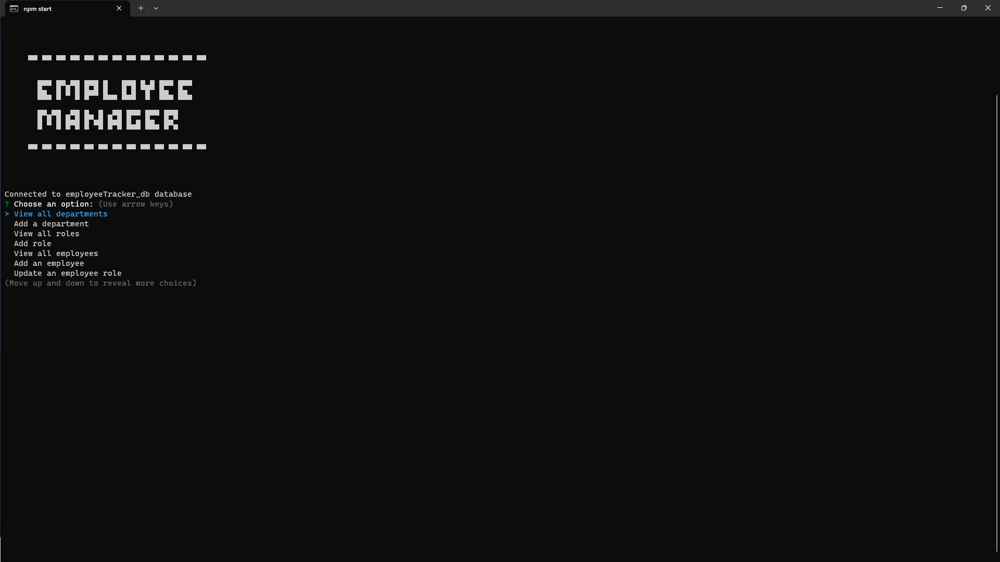
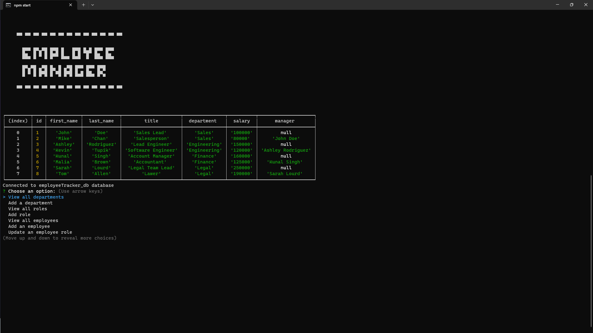
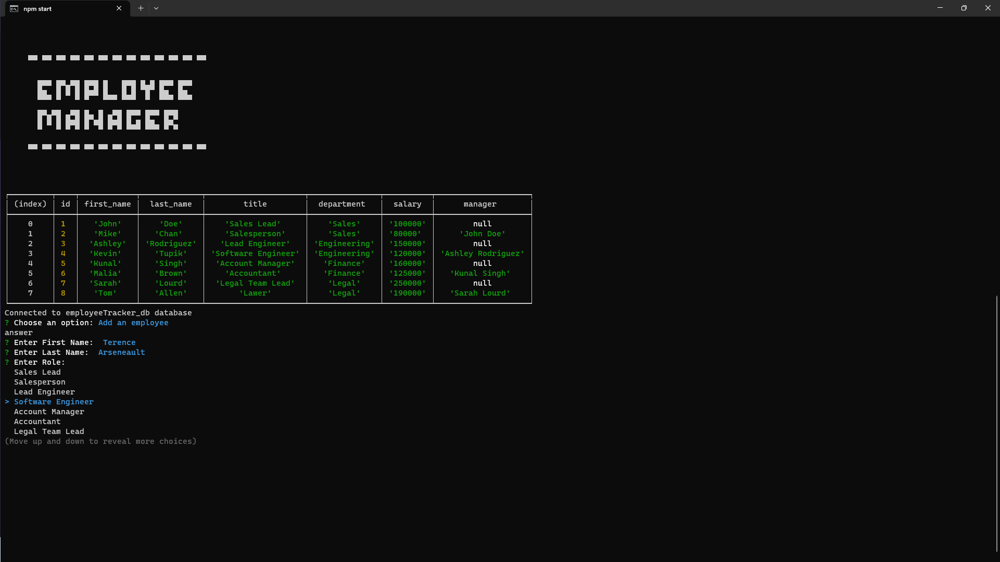

# EmployeeManagementTracker

## Description

- App for manage departments, roles, and employees of a company
- Ability to add employees, roles, and departments. View departments, roles and employes and also to update employee roles.
- Challenge completed for UNB Coding Bootcamp.
- Practice working with Database with MySQL, along with Javascript mysql2, Node.js, inquirer while creating a CMS.

## Installation

1. Clone Repo from Github
2. Open in your choice of code editor, run npm install for dependencies
3. Open mysql workbench or equivalant, run the schema.sql and seed.sql to get starter database
4. invoke app in node with "npm start"

## Screenshots

Video Walkthrough
